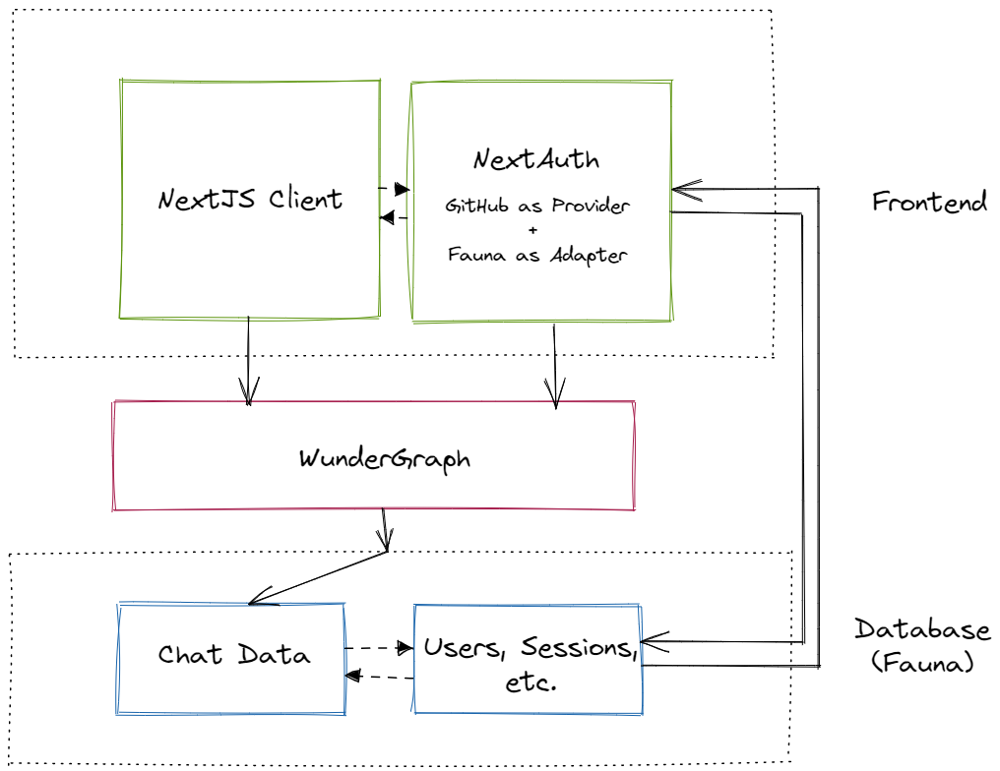

# Создание серверного Live Chat приложения с использованием Next.js, Fauna и WunderGraph для GraphQL Live Queries

Пошаговое руководство по созданию масштабируемого, чат-приложения реального времени с использованием серверных технологий... с небольшой помощью от NextAuth.js для входа через GitHub. Кому нужны WebSockets, когда у вас есть Live Queries? Не нам!

Если вы создаете приложения, которые работают с данными в реальном времени, вы, вероятно, используете WebSockets. Они позволяют веб-браузеру и веб-серверу общаться в реальном времени, поддерживая постоянное соединение между ними - данные отправляются клиентам, как только они становятся доступными, а не когда клиент постоянно опрашивает сервер на предмет новых данных.

Но что, если ваше приложение является серверным - работает на инфраструктуре, управляемой облачным провайдером, таким как AWS или GCP?

Для обеспечения высокой эластичности и отказоустойчивости эти среды разработаны так, чтобы быть без состояния и временными по своей природе, что означает, что нет гарантии, что ваш код будет работать на одном и том же физическом сервере от одного запроса к другому - и, следовательно, нет постоянного соединения между клиентом и сервером.

Итак, какое решение для создания приложений в реальном времени на серверных архитектурах? Давайте выясним! Давайте создадим этот чат в реальном времени в стиле Slack/Discord, используя Next.js в качестве нашего JS-фреймворка, Fauna (с использованием GraphQL) в качестве нашей базы данных, и WunderGraph в качестве Backend-for-Frontend ([BFF](https://bff-patterns.com/)), который обеспечивает связь между ними. Наше приложение также будет использовать вход через GitHub, и мы будем использовать знаменитый NextAuth (теперь [Auth.js](https://authjs.dev/)!) для наших нужд в области аутентификации.

Прежде чем мы начнем, давайте обсудим, как именно мы планируем решить проблему данных в реальном времени, если мы не можем использовать WebSockets.

## Live Queries на сервере - Секретный соус

Спецификация GraphQL определяет подписки - вы устанавливаете состояние WebSocket-соединения между клиентом и сервером, а затем подписываетесь на событие на сервере. Когда сервер видит событие, которое соответствует определенной подписке, он отправляет запрошенные данные по WebSocket-соединению клиенту - и вуаля, у нас есть наши данные.

> 💡 Это объяснение немного неоднозначное, но потерпите со мной. Обсуждение различий между транспортами graphql-ws (GraphQL через WebSocket), graphql-helix (GraphQL через SSE) и @n1ru4l/socket-io-graphql-server (GraphQL через Socket.io) немного выходит за рамки учебника.

Когда вы не можете использовать WebSockets (на серверных платформах, как упоминалось ранее), вы не можете использовать подписки... но здесь на помощь приходят Live Queries.

Они не являются частью спецификации GraphQL, поэтому точные определения отличаются в зависимости от клиентской библиотеки, но в сущности, в отличие от подписок, Live Queries стремятся подписаться на текущее состояние данных сервера - не события (новые полезные нагрузки всякий раз, когда запрос даст другие данные)... и в отличие от подписок, когда соединения WebSocket недоступны, они могут использовать старый добрый клиентский HTTP-опрос с интервалом.

Я вижу, как читатели берут в руки вилы, как раз вовремя.

Клиентский опрос для данных в реальном времени?! Это безумно дорого, а как насчет обработки нескольких клиентов, запрашивающих одни и те же данные?

И вы были бы правы! Но... здесь на помощь приходит WunderGraph. Видите ли, мы не собираемся опрашивать эти данные на стороне клиента. Вместо этого **мы перекладываем эти обязанности по Live Querying на Wundergraph**, наш Backend-for-Frontend, или API Gateway, как вы хотите его назвать.

WunderGraph - это инструмент для разработчиков, который позволяет вам определить ваши зависимости данных - GraphQL, REST API, базы данных Postgres и MySQL, Apollo Federations и все, что вы можете придумать - в виде конфигурации как код, а затем он интроспектирует их, превращая все это в виртуальный граф, который вы затем можете запросить и изменить через GraphQL, а затем представить в виде JSON-over-RPC для вашего клиента.

Когда вы делаете Live Queries из слоя WunderGraph, независимо от того, сколько пользователей подписаны на ваш чат в реальном времени на фронтенде, **у вас всегда будет активен только один экземпляр опроса в любой момент времени, для всего вашего приложения**.

Гораздо лучше, чем сырой клиентский опрос; но это идеально? Нет - интервал опроса все равно добавляет задержку и не идеален для приложений, которым нужна действительно мгновенная обратная связь, и без JSON-патча, весь результат запроса будет отправлен по проводу клиенту каждый раз, даже неизменные данные - но для нашего случая это вполне подходит.

С этим все, давайте приступим к кодированию!

## Архитектура

Прежде всего, давайте поговорим о потоке этого приложения.



Наши пользователи входят в систему со своим аккаунтом GitHub (через OAuth) для чат-комнаты. Мы создаем чат для рабочей группы/внутренней команды, и использование GitHub в качестве провайдера для этого имеет смысл.

Использование NextAuth значительно упрощает нашу историю с аутентификацией - и у него даже есть официальная интеграция с Fauna - серверной базой данных! Это делает последнюю действительно хорошим выбором в качестве базы данных как для аутентификации, так и для бизнес-логики (хранение сообщений чата).

Наш фронтенд Next.js относительно прост благодаря WunderGraph - он предоставит нам автоматически генерируемые (и типобезопасные!) хуки для запросов и мутаций, построенные поверх SWR от Vercel, и именно их наши компоненты будут использовать для получения (сообщения чата и список онлайн-пользователей) и записи (новые сообщения чата) данных.

Давайте начнем!

## Шаг 0: Настройка

### NextJS + WunderGraph

CLI `create-wundergraph-app` от WunderGraph - это лучший способ настроить как наш сервер BFF, так и фронтенд Next.js за один раз, так что давайте сделаем именно это. Просто убедитесь, что у вас установлена последняя LTS версия Node.js.

```
npx create-wundergraph-app my-project -E nextjs
```

Затем перейдите в каталог проекта и

```
npm install && npm start
```

### NextAuth

Настройка NextAuth требует немного рутинной работы. Давайте сначала разберемся с базовым пакетом.

```
npm install next-auth
```

Затем получите адаптер NextAuth для FaunaDB. "Адаптер" в NextAuth.js подключает ваше приложение к любой базе данных или системе бэкенда, которую вы хотите использовать для хранения данных пользователей, их учетных записей, сессий и т.д. Адаптеры технически необязательны, но поскольку мы хотим сохранять сессии пользователей для нашего приложения, нам понадобится один.

```
npm install @next-auth/fauna-adapter faunadb
```

Наконец, нам понадобится "провайдер" - доверенные сервисы, которые можно использовать для входа пользователя в систему. Вы могли бы определить свой собственный провайдер OAuth, если бы хотели, но здесь мы можем просто использовать встроенный провайдер GitHub.

[Прочтите документацию по OAuth GitHub](https://developer.github.com/apps/building-oauth-apps/authorizing-oauth-apps), чтобы узнать, как зарегистрировать свое приложение, настроить его и получить URL и секретный ключ от вашего аккаунта GitHub (НЕ опционально). Для URL обратного вызова в настройках GitHub используйте `http://localhost:3000/api/auth/callback/github`

Наконец, когда у вас есть идентификатор клиента GitHub и секретный ключ, поместите их в файл ENV вашего Next.js (как `GITHUB_ID` и `GITHUB_SECRET`) соответственно.

## Шаг 1: Данные

Fauna - это географически распределенная (идеально подходит для серверной/Edge эры Vercel и Netlify) документно-реляционная база данных, которая стремится предложить лучшее из обоих миров SQL (моделирование на основе схемы) и NoSQL (гибкость, скорость).

Она предлагает GraphQL из коробки, но самое интересное в Fauna - это то, что она делает тривиально простым определение хранимых процедур и их представление в виде запросов GraphQL через схему. (Они называют это User Defined Functions или UDFs). Очень крутые вещи! Мы будем использовать это щедро.

- Зарегистрируйтесь в Fauna 
- Создайте базу данных (без образцовых данных),
- Запишите ваш URL и Secret в вашем Next.js ENV (как `FAUNADB_GRAPHQL_URL` и `FAUNADB_TOKEN` соответственно) и переходите к следующему шагу.

### Аутентификация

Чтобы использовать Fauna в качестве нашей базы данных для аутентификации, нам нужно определить ее коллекции (подумайте о таблицах) и индексы (все поиски в Fauna выполняются с их использованием) определенным образом. NextAuth проводит нас через эту процедуру здесь, так что это просто вопрос копирования и вставки этих команд в вашу оболочку Fauna.

Сначала коллекции...

```
CreateCollection({ name: "accounts" })

CreateCollection({ name: "sessions" })

CreateCollection({ name: "users" })

CreateCollection({ name: "verification_tokens" })
```

...затем индексы.

```
CreateIndex({
  name: "account_by_provider_and_provider_account_id",
  source: Collection("accounts"),
  unique: true,
  terms: [
    { field: ["data", "provider"] },
    { field: ["data", "providerAccountId"] },
  ],
})
CreateIndex({
  name: "session_by_session_token",
  source: Collection("sessions"),
  unique: true,
  terms: [{ field: ["data", "sessionToken"] }],
})
CreateIndex({
  name: "user_by_email",
  source: Collection("users"),
  unique: true,
  terms: [{ field: ["data", "email"] }],
})
CreateIndex({
  name: "verification_token_by_identifier_and_token",
  source: Collection("verification_tokens"),
  unique: true,
  terms: [{ field: ["data", "identifier"] }, { field: ["data", "token"] }],
})
```

Теперь, когда у нас есть Fauna, настроенная для удовлетворения наших потребностей в аутентификации, вернитесь в каталог вашего проекта и создайте файл `./pages/api/auth/[...nextauth].ts` с этим содержимым:

```js
import NextAuth from "next-auth";
import GithubProvider from "next-auth/providers/github"
import { Client as FaunaClient } from "faunadb"
import { FaunaAdapter } from "@next-auth/fauna-adapter"


const client = new FaunaClient({
  secret: process.env.FAUNA_SECRET,
  scheme: "https",
  domain: "db.fauna.com",
})

export const authOptions = {
  // Configure one or more authentication providers
  providers: [
    GithubProvider({
      clientId: process.env.GITHUB_ID,
      clientSecret: process.env.GITHUB_SECRET,
    }),
    // ...add more providers here
  ],
  adapter: FaunaAdapter(client)
};
export default NextAuth(authOptions)
```

Вот и все, у нас есть некоторая базовая настройка аутентификации! Мы протестируем это через минуту. Но сначала…

### Бизнес-логика

Как только мы закончим с аутентификацией, пришло время определить схему GraphQL, необходимую для нашей бизнес-логики, т.е. пользователей, чатов и сессий (с небольшими изменениями для учета существующей схемы NextAuth). Перейдите на вкладку GraphQL в вашей панели управления Fauna и импортируйте эту схему.

```graphql
type users {
    name: String!
    email: String!
    image: String!
}

type chat {
    content: String!
    user:  users! 
    timestamp: String!
}

type sessions {
    sessionToken: String!
    userId:  String!
    expires: String!
}

type Query {
    allMessages: [chat!]
    allUsers: [users!]
    allSessions: [sessions!]
    userIDByEmail(email: String!): String! @resolver(name: "getUserIDByEmail")
}
```

Почему у чата есть надлежащее отношение к пользователям, но не к сессиям? Это ограничение того, как NextAuth в настоящее время взаимодействует с Fauna для хранения сессий пользователей - но мы обойдем это, как вы скоро увидите.

Видите последний запрос, помеченный директивой @resolver? Это хранимая процедура Fauna (User Defined Function), которую мы будем создавать! Перейдите на вкладку Functions и добавьте ее.

`getUserIDByEmail`
```
Query(

	Lambda(

		["email"],

		Select(["ref", "id"], Get(Match(Index("user_by_email"), Var("email"))))

	)

)
```

Знание синтаксиса FQL помогает, но эти функции должны быть самоочевидными - они делают именно то, что предлагают их названия - принимают аргумент и ищут значение(я), которые соответствуют ему, используя ранее определенные индексы. Когда они используются с директивой `@resolver` в нашей схеме, они теперь представлены в виде запросов GraphQL - невероятно полезно. Вы можете делать почти все, что захотите, с UDFs Fauna, и возвращать любые данные, которые захотите.

## Шаг 2: Зависимости данных и операции

WunderGraph работает, интроспектируя все источники данных, которые вы определяете в массиве зависимостей, и создавая для них модели данных.

Сначала убедитесь, что ваш файл ENV настроен правильно...

```
GITHUB_ID="XXXXXXXXXXXXXXXX"

GITHUB_SECRET="XXXXXXXXXXXXXXXX"

FAUNA_SECRET="XXXXXXXXXXXXXXXX"

FAUNADB_GRAPHQL_URL="https://graphql.us.fauna.com/graphql"

FAUNADB_TOKEN="Bearer XXXXXXXXXXXXXXXX"
```

Замените на свои собственные значения, очевидно. Также дважды проверьте, чтобы URL Fauna был установлен в регионе, где вы размещаете свой экземпляр!

...а затем добавьте нашу базу данных Fauna в качестве зависимости в WunderGraph, и позвольте ему сделать свое дело.

```js
const fauna = introspect.graphql({
	apiNamespace: 'db',
	url: new EnvironmentVariable('FAUNADB_GRAPHQL_URL'),
	headers: (builder) => {
	  builder.addStaticHeader(
		'Authorization',
		new EnvironmentVariable('FAUNADB_TOKEN')
	  )
	  return builder
	},
})

// configureWunderGraph emits the configuration
configureWunderGraphApplication({
	apis: [fauna],
 ...
})
```

Затем вы можете написать запросы/мутации GraphQL для определения операций над этими данными (они идут в каталог `.wundergraph/operations`), и WunderGraph сгенерирует типобезопасные хуки клиента Next.js для доступа к ним.

`AllMessages.graphql`
```graphql
query FindAllMessages() {
  db_allMessages {
    data {
      content
      timestamp
      user {
        _id
        name
        email
        image
      }
    }
  }
}
```

Получение всех сообщений, вместе с их связанными пользователями.

`AllSessions.graphql`
```graphql
query AllSessions($userId: ID! @internal) {
  db_allSessions {
    data {
      userId @export(as: "userId")
      user: _join @transform(get: "db_findUsersByID") {
        db_findUsersByID(id: $userId) {
          name
          email
          image
        }
      }
    }
  }
}
```

Способ работы NextAuth с GitHub заключается в том, что он хранит текущие активные сессии в базе данных, с полем `expires`. Вы можете прочитать `userId` из активной таблицы сессий, и тот, кому принадлежит этот `userId`, может считаться текущим пользователем в сети.

Таким образом, этот запрос GraphQL извлекает всех пользователей, у которых в настоящее время есть активная сессия - мы будем использовать это в нашем пользовательском интерфейсе, чтобы указать на тех, кто онлайн. WunderGraph делает тривиальным выполнение JOIN с использованием нескольких запросов - и используя его поле [`_join`](https://docs.wundergraph.com/docs/core-concepts/_join-field#__next) (и директиву [`@transform`](https://docs.wundergraph.com/docs/directives-reference/transform-directive#__next) для уменьшения ненужного вложения), мы можем преодолеть то, что NextAuth не добавляет надлежащие отношения в Fauna - видно здесь при извлечении пользователя, связанного с сессией по их `userId`.

С достаточно коротким временем жизни для токенов OAuth GitHub, вам не придется беспокоиться об устаревших данных, когда речь идет об онлайн-пользователях, и NextAuth достаточно умный, чтобы аннулировать устаревшие токены в любом случае, когда эти пользователи пытаются войти с истекшим токеном.

`UserByEmail.graphql`
```graphql
query UserByEmail($emailId: String!) {
  db_userIDByEmail(email: $emailId)
}
```

`CreateMessage.graphql`
```graphql
mutation CreateMessage ($content: String!, $userId: ID!, $timestamp: String!){
  db_createChat(data: {
    content: $content
    user: {
        connect: $userId
    }
    timestamp: $timestamp
  }){
    _id
  }
}
```

И, наконец, это наша единственная мутация, срабатывающая, когда в настоящее время вошедший в систему пользователь отправляет новое сообщение. Здесь вы видите, как Fauna обрабатывает отношения в мутациях - поле `connect` (подробнее [здесь](https://docs.fauna.com/fauna/current/api/graphql/relationships#connect)) используется для соединения текущего создаваемого документа (сообщение чата) с существующим документом (пользователь).

## Шаг 3: Root

`_app.tsx`
```tsx
import Head from "next/head";
import Navbar from "../components/Navbar";
import "../styles/globals.css";
import { SessionProvider } from "next-auth/react";

function MyApp({ Component, pageProps: { session, ...pageProps } }) {
  return (
    <SessionProvider session={session}>
      <Head>
        <meta charSet="UTF-8" />
        <meta name="viewport" content="width=device-width, initial-scale=1.0" />
      </Head>
      <header className="sticky top-0 z-50">
        <Navbar />
      </header>
      <main className="h-[calc(100vh-80px)] bg-gradient-to-b from-gray-700 to-gray-900">
        <Component {...pageProps} />
      </main>
    </SessionProvider>
  );
}

export default MyApp;
```

Вам придется обернуть ваше приложение в `<SessionProvider>`, чтобы иметь возможность использовать хуки `useSession` от NextAuth, предоставляя контекст сессии на верхнем уровне вашего приложения.

Также я использую TailwindCSS для стилизации - инструкции по его настройке с Next.js [здесь](https://tailwindcss.com/docs/guides/nextjs).

`index.tsx`
```tsx
import { NextPage } from "next";
import Chat from "../components/Chat";
import { withWunderGraph } from "../components/generated/nextjs";
import { useSession, signIn } from "next-auth/react";

const Home: NextPage = () => {
  const { data: session } = useSession();
  return (
    <div>
      {session ? (
        <div className="w-full h-[calc(100vh-85px)] ">
          <Chat />
        </div>
      ) : (
        <div className="w-full h-[calc(100vh-80px)] flex flex-col items-center justify-center bg-[radial-gradient(ellipse_at_right,_var(--tw-gradient-stops))] from-gray-700 via-gray-900 to-black p-4 ">
          <span className="text-white text-8xl font-semibold ">Привет!</span> <br />
          <span className="text-white text-lg">Вам нужно войти в систему, чтобы получить доступ к нашему чату рабочей группы.</span> <br />
          <button className=" bg-teal-500 hover:bg-teal-700 text-gray-800 font-bold py-2 px-4 rounded-full" onClick={() => signIn()}>
            Войти в систему
          </button>
        </div>
      )}
    </div>
  );
};

export default withWunderGraph(Home);
```

Хуки NextAuth делают реализацию авторизации тривиально простой - вторую часть аутентификации. Используйте `useSession`, чтобы проверить, вошел ли кто-то в систему (это возвращает объект пользователя с именем пользователя GitHub, электронной почтой и URL аватара - удобно!), и хуки `signIn` и `signOut` для автоматического перенаправления пользователей на эти страницы.

Вы можете стилизовать собственные страницы входа/выхода NextAuth, если хотите (инструкции [здесь](https://next-auth.js.org/configuration/pages)), но стандартные, не брендированные стили вполне подходят для наших нужд.

## Шаг 4: Онлайн пользователи

`./components/OnlineUsers.tsx`
```tsx
import { useQuery } from "../components/generated/nextjs";

const OnlineUsers = () => {
  const { data: onlineUsers } = useQuery({
    operationName: "AllSessions",
  });
  return (
    <div className="scrollbar scrollbar-thumb-black scrollbar-track-gray-100 h-full w-[20%] divide-y overflow-y-scroll bg-gray-900">
      {onlineUsers?.db_allSessions?.data?.map((user) => (
        <div className="flex w-full flex-row items-center p-2">
          <div className="h-[20px] w-[20px] rounded-[50%] bg-green-500"></div>
          <div key={user.userId} className="ml-2 py-2 font-bold text-white ">
            {user.user.name}
          </div>
        </div>
      ))}
     </div>
  );
};

export default OnlineUsers;
```

Здесь нечего особо смотреть; наша стратегия определения онлайн-пользователей уже упоминалась в запросе GraphQL для этого.

## Шаг 5: Окно чата (лента и ввод)

`./components/ChatWindow.tsx`
```tsx
import React from "react";
/**
 * wundergraph stuff
 */
import {
  useQuery,
  useMutation,
  withWunderGraph,
} from "../components/generated/nextjs";
/**
 * nextauth stuff
 */
import { useSession } from "next-auth/react";
/**
 * nextjs stuff
 */
import Link from "next/link";
/**
 * my utility funcs
 */
import epochToTimestampString from "../utils/epochToTimestampString";
//---
const ChatWindow = () => {
  /**
   * get current session data with nextauth
   *  */
  const { data: session } = useSession();
  /**
   * queries + mutations with WG
   */
  const { data: allMessages } = useQuery({
    operationName: "AllMessages",
    liveQuery:true
  });
  const { data: currentUserID } = useQuery({
    operationName: "UserIDByEmail",
    input: {
      emailId: session.user.email,
    },
  });
  const {
    data: addedMessageID,
    error,
    trigger,
    isMutating,
  } = useMutation({
    operationName: "CreateMessage",
  });
  /**
   * local state
   */
  const [submitDisabled, setSubmitDisabled] = React.useState<boolean>(true);
  const [newMessage, setNewMessage] = React.useState<string>("");
  const messagesRef = React.useRef<HTMLDivElement>(null);
  React.useEffect(() => {
    messagesRef.current.scrollTop = messagesRef.current.scrollHeight;
  }, [allMessages]); // Only re-run the effect if messages state changes

  /**
   * event handlers
   */
  const handleSubmit = (event: React.FormEvent) => {
    event.preventDefault();
    //trigger mutation with current message, userid, and timestamp
    trigger({
      content: newMessage,
      userId: currentUserID?.db_userIDByEmail,
      timestamp: epochToTimestampString(
        Math.floor(new Date().getTime() / 1000.0)
      ),
    });
    // then reset message and redisable button

    setNewMessage("");
    setSubmitDisabled(true);
  };
  //---
  return (
    <div className="w-[80%] ">
      <div
        ref={messagesRef}
        className="scrollbar scrollbar-thumb-teal-500 scrollbar-track-black h-[93%] w-full overflow-y-scroll bg-[radial-gradient(ellipse_at_right,_var(--tw-gradient-stops))]  from-gray-700 via-gray-900 to-black  p-4 "
      >
        {/* Chat messages go here */}
        {allMessages?.db_allMessages?.data.map((message) => (
          /* adjust alignment if current user */
          <div
            className={
              message.user?.email === session.user.email
                ? "my-4 ml-auto mr-2  flex w-fit max-w-md flex-col rounded-lg bg-zinc-200  px-4 py-2 text-gray-700"
                : "my-4 mr-auto ml-2 flex w-fit max-w-md flex-col rounded-lg  bg-gray-900 p-4 text-zinc-200  "
            }
          >
            <Link href={`https://www.github.com/${message.user?.name}`}>
              <span className="mb-2 cursor-pointer rounded-lg text-sm underline ">
                {message.user?.name}
              </span>
            </Link>

            <span className="font-bold ">{message.content}</span>

            <span
              className={`pt-2 text-right text-xs ${
                message.user?.email === session.user.email
                  ? "text-red-700"
                  : "text-teal-500"
              } mb-2 rounded-lg font-bold`}
            >
              {message.timestamp}
            </span>
          </div>
        ))}
      </div>
      {/* Input field for sending messages */}
      <div className="h-[7%] w-[98%] px-2 py-2">
        <form onSubmit={handleSubmit} className="relative rounded-md shadow-sm">
          <input
            type="text"
            value={newMessage}
            onChange={(event) => {
              setNewMessage(event.target.value);
              if (event.target.value.length > 0) {
                setSubmitDisabled(false);
              } else {
                setSubmitDisabled(true);
              }
            }}
            placeholder="Type your message here..."
            className="z-10 w-5/6 rounded-md border-[1px] bg-zinc-200 p-2 text-gray-900 focus:outline-none"
          />
          <button
            type="submit"
            className="z-20 w-1/6 rounded-r-full bg-teal-500 py-2 px-4 font-bold text-white hover:bg-teal-700 disabled:bg-teal-200 disabled:text-gray-500"
            disabled={submitDisabled || isMutating}
          >
            Send
          </button>
        </form>
      </div>
    </div>
  );
};

export default withWunderGraph(ChatWindow);
```

Здесь мы видим, как WunderGraph может превратить любой стандартный запрос в Live Query с добавлением всего одного параметра - `liveQuery: true`. Чтобы настроить интервалы опроса для Live Queries, проверьте `./wundergraph/wundergraph.operations.ts` и отрегулируйте это значение в секундах.

```ts
queries: (config) => ({
			...config,
			caching: {
				enable: false,
				staleWhileRevalidate: 60,
				maxAge: 60,
				public: true,
			},
			liveQuery: {
				enable: true,
				pollingIntervalSeconds: 1,
			},
      //...
    });
```

Для временной метки мы будем использовать простую вспомогательную функцию, чтобы получить текущее время в эпохе - количество секунд, прошедших с 1 января 1970 года (полночь по UTC/GMT) - и преобразовать его в строку, понятную человеку, для хранения в нашей базе данных.

`./utils/epochToTimestampString.ts`
```tsx
/*
Converts seconds to human readable date and time
*/
export default function epochToTimestampString(seconds: number): string {
  return (new Date(seconds * 1000)).toLocaleString();
}
```

## Шаг 6 - Навигационная панель

`./components/Navbar.tsx`
```tsx
import { useSession, signOut } from "next-auth/react";

const Navbar = () => {
  const { data: session } = useSession();
  return (
    <nav className="flex h-[80px] w-screen items-center justify-between border-b-2 border-gray-900 bg-black p-6">
      <div className="container flex min-w-full items-center justify-between pr-4">
        <div className="text-xl font-semibold tracking-tight text-white">
          #workgroup
        </div>

        <div className="flex items-center">
          {session && (
            <>
              <div className="mr-4 cursor-pointer tracking-tight text-teal-200">
                <span className="text-white ">@{session.user?.name}</span>
              </div>
              <div className="mr-4 cursor-pointer">
                
              </div>
              <div
                className="cursor-pointer tracking-tight text-teal-200 hover:bg-gray-800 hover:text-white"
                onClick={() => signOut()}
              >
                Logout
              </div>
            </>
          )}
        </div>
      </div>
    </nav>
  );
};

export default Navbar;
```

Компонент NavBar снова использует хуки useSession от NextAuth - сначала, чтобы получить текущее имя пользователя GitHub и URL аватара и отобразить их, а затем signOut для... ну, выхода из системы.

## Вот и все, народ!

Совмещение NextAuth, Fauna и WunderGraph для GraphQL Live Queries - это мощное сочетание, которое будет служить вам хорошо при создании интерактивных чатов в реальном времени - будь то простое создание для небольшого сообщества или сложные платформы уровня предприятия.

Для серверных приложений использование WunderGraph в качестве backend-for-frontend с GraphQL Live Queries даст вам гораздо лучшую задержку, чем клиентский опрос - только один экземпляр опроса для всех клиентов, подписанных на приложение для чата, равно уменьшенной нагрузке на сервер и сетевому трафику.

Вот некоторые вещи, на которые стоит обратить внимание, продвигаясь вперед:

### Для качества жизни

1. Оставьте `liveQuery: true` закомментированным, пока вы строите пользовательский интерфейс, и включите его только при тестировании функций чата. Вы не хотите нагружать сервер Fauna вызовами - особенно если вы на ограниченном бесплатном тарифе!
2. Если вы вносите изменения в схему GraphQL Fauna во время разработки, вы, вероятно, обнаружите, что интроспекция WunderGraph не улавливает новые изменения. Это намеренно - он строит кэш после первой интроспекции и работает на основе этого, потому что вы не хотите, чтобы WunderGraph (который вы бы развернули в продакшене на Fly.io или WunderGraph Cloud) тратил ресурсы на полные интроспекции каждый раз. Чтобы обойти это, запустите `npx wunderctl generate –-clear-cache`, если вы внесли изменения в схему базы данных во время разработки и хотите, чтобы модели и хуки были сгенерированы заново.

### Для развертывания

1. Развертывание этой комбинации довольно простое; WunderGraph - это сервер Go и [может быть развернут на Fly.io](https://docs.wundergraph.com/docs/deployment/flyio#__next) или [управляемой облачной платформе WunderGraph Cloud](https://docs.wundergraph.com/docs/cloud/deployments#__next), Fauna уже имеет ваши данные в управляемых экземплярах, а ваш фронтенд Next.js может быть развернут на Vercel или Netlify.
2. Кстати говоря - установите переменную среды `NEXTAUTH_URL` в канонический URL веб-сайта при его развертывании.

Если вам нужно что-то прояснить по поводу WunderGraph в качестве BFF/API Gateway, загляните в их сообщество Discord, [здесь](https://wundergraph.com/discord). Удачного кодирования!
